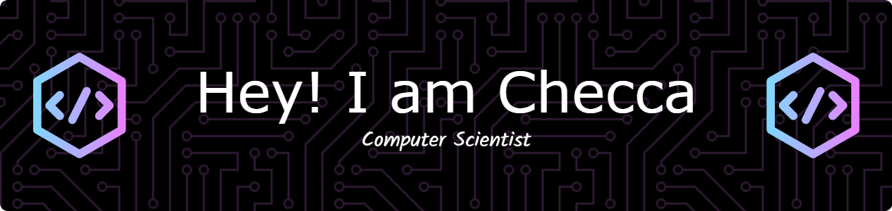

<li>💻 I’m currently learning: <strong>Bachelor’s Degree in Computer Science | University of Naples Parthenope</strong></li>

<h3 align="left">Connect with me</h3>

  
  
  
  

###

<h3 align="left">Languages and Tools</h3>

<h3 align="left">Software</h3>

  
  
  
  
  
  
  

<h3 align="left">Stats</h3>

&nbsp;

<h2 align="left">⚡Activity Graph:</h2>

